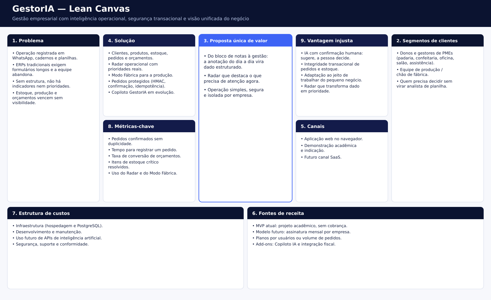
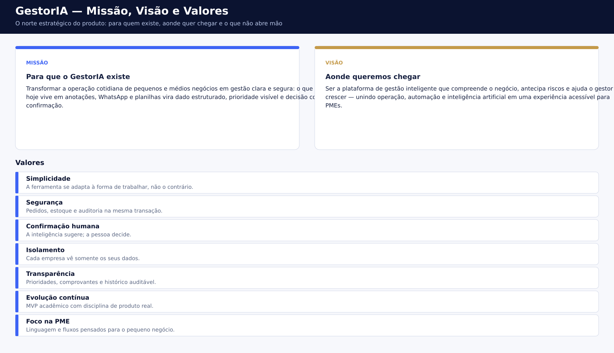

# Documento de Contexto

**Produto:** GestorIA  
**Tipo:** plataforma de gestão empresarial (MVP acadêmico em evolução)  
**Disciplinas de origem:** TAI III e gestão de startups — 6º período  
**Data:** setembro de 2026  
**Documentos relacionados:** [Especificação do Projeto.md](Especificação%20do%20Projeto.md), [README.md](README.md)

---

## 1. Identificação

O **GestorIA** é uma plataforma web de gestão para pequenos e médios negócios. Ela centraliza clientes, produtos, estoque, pedidos, orçamentos e produção, e transforma esses dados em prioridades visíveis no **Radar GestorIA**.

O projeto nasceu como trabalho acadêmico, mas foi estruturado como um produto real: backend em camadas, PostgreSQL, isolamento entre empresas, operações transacionais, autenticação e testes automatizados.

A ideia original — registrar a operação em linguagem natural, como em um bloco de notas — continua no centro da visão. O **Copiloto GestorIA** é a camada que deve interpretar essas anotações, estruturar os dados e só persistir depois da confirmação da pessoa. Hoje a interface do Copiloto já existe; a inteligência e a execução segura de ações ainda estão em evolução.

## 2. Problema

Pequenas empresas frequentemente registram o dia a dia em WhatsApp, grupos internos, cadernos, blocos de notas e planilhas. Essas ferramentas são rápidas, mas as informações ficam soltas: fica difícil saber o que está em produção, o que falta no estoque, quais orçamentos vencem e quanto cada cliente já comprou.

Sistemas tradicionais de gestão resolvem a estrutura, mas cobram um preço alto de atenção. Exigem muitos campos, telas e etapas. A equipe volta a anotar de forma informal, e o sistema deixa de refletir a operação.

O resultado é o mesmo nos dois extremos: ou a empresa tem agilidade sem controle, ou tem controle sem adesão.

## 3. Oportunidade

Há espaço para um produto que aceite o jeito informal de trabalhar e, ainda assim, entregue gestão de verdade. O GestorIA parte de três hipóteses:

1. O gestor de PME quer **ver o que precisa de atenção agora**, não preencher mais um formulário.
2. A equipe só usa o sistema se o registro for **rápido e revisável**.
3. Pedido e estoque só merecem confiança se a operação for **transacional, confirmada e auditável**.

O produto atual já cobre a segunda e a terceira hipóteses nos módulos operacionais. A primeira aparece no Radar. A camada de linguagem natural — a primeira hipótese levada ao registro do dia a dia — é o próximo salto, via Copiloto.

## 4. Público-alvo

| Perfil | Necessidade principal |
| --- | --- |
| Dono ou gestora de PME | Visão única da operação, prioridades e indicadores sem virar analista de planilha |
| Equipe administrativa | Cadastro de clientes, produtos, pedidos e orçamentos com regras claras |
| Equipe de produção | Acompanhar pedidos em preparo, concluir ordens e consultar insumos (Modo Fábrica) |
| Segmentos-alvo iniciais | Padaria, confeitaria, oficina, salão, assistência técnica e negócios semelhantes |

O cadastro da empresa e o contexto do segmento existem para que, no futuro, a interpretação de mensagens e os fluxos se adaptem ao vocabulário de cada negócio.

## 5. Contexto acadêmico e de produto

O GestorIA é desenvolvido como projeto de curso com ambição de startup. Isso impõe duas disciplinas ao mesmo tempo:

- **Acadêmica:** documentar problema, proposta de valor, missão e especificação; evoluir o MVP de forma incremental.
- **De produto:** arquitetura multi-tenant, segurança das operações, testes e um caminho crível até um SaaS.

O estado atual é de **MVP em evolução**. Os módulos principais de gestão já usam a API real. Copiloto, relatórios avançados e integração fiscal ainda têm partes em desenvolvimento ou apenas demonstração visual.

## 6. Solução em uma frase

O GestorIA organiza a operação da pequena empresa e transforma dado operacional em prioridade — com a ambição de um dia aceitar a anotação em linguagem natural e só gravar depois da confirmação humana.

Fluxo pretendido:

```text
Linguagem natural → interpretação → dados estruturados → confirmação → gestão
```

Exemplo da visão de produto: *"Maria pediu dois bolos de chocolate de 2 kg para sábado por 160 reais."* O sistema identifica cliente, produto, quantidade, data e valor, mostra o resumo e só então registra o pedido.

Enquanto o Copiloto não executa esse fluxo de ponta a ponta, a empresa já opera pelos cadastros, pelo Radar e pelo Modo Fábrica.

## 7. O que já existe no produto

- Autenticação com JWT, senha com Argon2 e papéis `owner`, `admin` e `member`.
- Isolamento dos dados por empresa (`organization_id` em toda tabela de negócio).
- CRUD de clientes e produtos, com perfil comercial, endereço, estoque mínimo e status derivado.
- Pedidos com baixa de estoque em transação única e recomposição ao cancelar.
- Criação protegida de pedidos: proposta assinada (HMAC-SHA256), validade, idempotência, comprovante e auditoria.
- Orçamentos com preço histórico, validade, aprovação e conversão única em pedido.
- Dashboard com indicadores reais e **Radar GestorIA** (produção, estoque crítico, orçamentos próximos do vencimento).
- **Modo Fábrica** para acompanhar a produção em tempo real.
- Interface do Copiloto, ainda sem orquestração de IA que execute ações.

## 8. Stakeholders

| Stakeholder | Interesse |
| --- | --- |
| Equipe de desenvolvimento | Evoluir o MVP sem quebrar regras de estoque, tenant e segurança |
| Professores e banca | Clareza de problema, proposta de valor e especificação |
| Empresa usuária (demo e futuras PMEs) | Registrar a operação com confiança e ver prioridades |
| Operação / fábrica | Status dos pedidos e insumos |
| Futuro Copiloto | Só executar o que a pessoa confirmou, no mesmo contrato seguro dos pedidos |

## 9. Escopo deste documento

Este documento descreve o **contexto de negócio e de produto**. A especificação técnica, os requisitos, as regras e as APIs estão em [Especificação do Projeto.md](Especificação%20do%20Projeto.md).

Não fazem parte do contexto operacional atual, embora apareçam na visão:

- emissão real de notas fiscais;
- cobrança e planos comerciais (o MVP é acadêmico);
- aplicativo nativo mobile;
- integração com WhatsApp ou outros canais externos.

## 10. Premissas e restrições

- Uma sessão autenticada pertence a **uma empresa**. O tenant não é escolhido no formulário de pedido.
- Preço de pedido e de orçamento é **congelado** no momento do registro; o cliente da API não envia o valor de venda.
- Estoque insuficiente **bloqueia** a criação do pedido; nada parcial é gravado.
- A criação direta `POST /api/orders` está encerrada para novas vendas: o fluxo passa por proposta e confirmação.
- A conversão de orçamento ainda não gera o envelope HMAC da camada protegida.
- O Copiloto não deve inventar dados faltantes: pede esclarecimento ou espera confirmação.
- Ambiente de referência: Docker Compose, FastAPI, PostgreSQL 17, frontend HTML/JavaScript servido pela própria API.

## 11. Referências internas

- [README.md](README.md) — visão geral e instruções de execução
- [Especificação do Projeto.md](Especificação%20do%20Projeto.md) — requisitos e arquitetura
- [docs/SEGURANCA_PEDIDOS.md](docs/SEGURANCA_PEDIDOS.md) — contrato das operações protegidas
- [Documentação de Contexto/README-produto.md](Documentação%20de%20Contexto/README-produto.md) — tese original do bloco de notas inteligente

---

## Lean Canvas

O Lean Canvas (Ash Maurya) resume o GestorIA em uma página: problema, cliente, proposta de valor, solução, canais, receita, custos, métricas e vantagem. Foi preenchido com o produto **como está** e com a direção de startup, sem tratar o MVP acadêmico como se já cobrasse assinatura.

Leitura útil do canvas:

- O **problema** e os **segmentos** justificam um sistema simples o bastante para a PME e rigoroso o bastante para estoque e pedido.
- A **proposta única de valor** une o bloco de notas inteligente (visão) ao Radar e à operação já implementada.
- A **vantagem injusta** que o time pode defender hoje não é “ter IA”, e sim **IA com confirmação humana** somada à **integridade transacional** dos pedidos.
- **Receita** descreve o modelo futuro. No momento não há cobrança.

A versão em PDF, útil para impressão e anexos da disciplina, está em [docs/pdf/lean-canvas.pdf](docs/pdf/lean-canvas.pdf).



---

## Missão, Visão e Valores

Missão, visão e valores não substituem o canvas: eles dizem **por que o produto existe**, **aonde quer chegar** e **o que não se negocia** enquanto o MVP cresce.

- **Missão** ancora o dia a dia: tirar a operação do informal e devolvê-la como gestão clara, com a pessoa no controle da confirmação.
- **Visão** descreve a startup que o projeto quer ser: uma plataforma que compreende o negócio e ajuda o gestor a antecipar risco, não só a cadastrar pedido.
- **Valores** protegem decisões de produto. Se uma feature de IA executar ação sem confirmação, ou um atalho de pedido pular a transação, o valor foi violado — mesmo que a tela fique mais rápida.

A versão em PDF está em [docs/pdf/missao-visao-valores.pdf](docs/pdf/missao-visao-valores.pdf).


