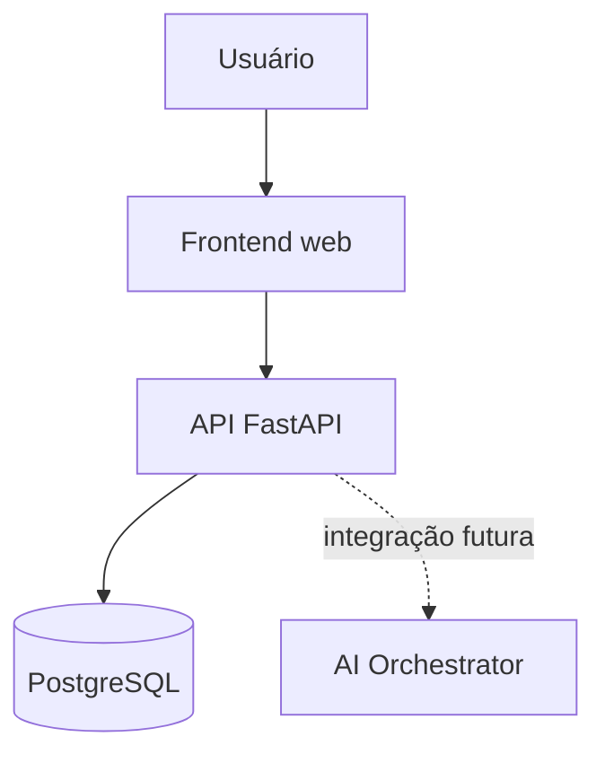

<div align="center">

# GestorIA

**Inteligência que organiza.**

Plataforma de gestão empresarial que transforma linguagem natural em dados estruturados e operações confiáveis.


</div>

## Sobre o projeto

O **GestorIA** é uma plataforma web criada para simplificar a gestão de empresas por meio da Inteligência Artificial. A proposta é permitir que gestores e equipes registrem, consultem e analisem informações utilizando linguagem natural, sem depender de fluxos complexos ou de múltiplos formulários.

O projeto nasceu como uma iniciativa acadêmica de estudantes do 6º período de Ciência da Computação da PUC Minas, com a intenção de evoluir para um produto real. Por isso, o MVP já adota fundamentos de arquitetura, segurança, organização de código e isolamento de dados compatíveis com a evolução futura da plataforma.

## Estado atual do MVP

Nesta etapa, o sistema possui uma base funcional para autenticação e gerenciamento de produtos:

- Login integrado ao backend.
- Senhas protegidas com Argon2.
- Sessões autenticadas com JWT.
- Usuários vinculados a empresas.
- Arquitetura multi-tenant com isolamento por `organization_id`.
- Cadastro, listagem, edição e exclusão de produtos.
- Persistência dos dados em PostgreSQL.
- Migrations versionadas com Alembic.
- Documentação interativa da API.
- Testes automatizados de autenticação, CRUD e isolamento entre empresas.

As telas de clientes, pedidos, orçamentos, relatórios e IA ainda funcionam como demonstrações do produto e serão conectadas ao backend nas próximas etapas.

## Arquitetura



O frontend nunca acessa o banco diretamente. Todas as operações passam pela API, responsável por autenticação, autorização, validação, regras de negócio e isolamento dos dados de cada empresa.

## Tecnologias

| Camada | Tecnologias |
| --- | --- |
| Frontend | HTML, CSS e JavaScript |
| Backend | Python 3.12 e FastAPI |
| Persistência | PostgreSQL 17 e SQLAlchemy 2 |
| Migrations | Alembic |
| Autenticação | JWT e Argon2 |
| Infraestrutura local | Docker e Docker Compose |
| Testes | Pytest e SQLite temporário |

## Estrutura do projeto

```text
gestoria/
├── backend/
│   ├── alembic/              # Migrations do banco
│   ├── app/
│   │   ├── api/              # Rotas e dependências HTTP
│   │   ├── config.py         # Configurações da aplicação
│   │   ├── database.py       # Conexão e sessões do banco
│   │   ├── models.py         # Entidades SQLAlchemy
│   │   ├── repositories.py   # Consultas controladas
│   │   ├── schemas.py        # Validação de entrada e saída
│   │   ├── security.py       # Hash de senha e JWT
│   │   ├── services.py       # Regras da aplicação
│   │   └── seed.py           # Dados iniciais de desenvolvimento
│   └── tests/                # Testes automatizados
├── startup-main/             # Dashboard do protótipo
├── LoginGestorIA.html        # Tela de autenticação
├── docker-compose.yml        # API e PostgreSQL
└── .env.example              # Variáveis de ambiente de exemplo
```

## Como executar

### Pré-requisitos

- Git
- Docker Desktop

### 1. Clonar o repositório

```bash
git clone https://github.com/LauraEliza19/gestoria.git
cd gestoria
```

### 2. Criar o arquivo de ambiente

No PowerShell:

```powershell
Copy-Item .env.example .env
```

No Linux, macOS ou Git Bash:

```bash
cp .env.example .env
```

### 3. Iniciar a aplicação

```bash
docker compose up --build
```

Quando os serviços estiverem ativos, acesse:

| Serviço | Endereço |
| --- | --- |
| Aplicação | http://localhost:8000 |
| Documentação da API | http://localhost:8000/docs |
| PostgreSQL | `localhost:5432` |

### Credenciais de desenvolvimento

```text
E-mail: admin@gestoria.dev
Senha:  GestorIA@123
```

Essas credenciais são exclusivas do ambiente local e podem ser alteradas no arquivo `.env`.

## Banco de dados

### Modelo atual

| Tabela | Responsabilidade |
| --- | --- |
| `organizations` | Empresas atendidas pela plataforma |
| `users` | Identidade e credenciais dos usuários |
| `organization_members` | Vínculo e papel do usuário em cada empresa |
| `products` | Catálogo isolado por `organization_id` |

O status de estoque é calculado pela aplicação a partir de `stock_quantity` e `is_active`, evitando duplicidade e inconsistência de dados.

### Conexão local

```text
Host:     localhost
Porta:    5432
Banco:    gestoria
Usuário:  gestoria
Senha:    gestoria_dev
```

Para acessar pelo terminal:

```bash
docker compose exec db psql -U gestoria -d gestoria
```

Comandos úteis no `psql`:

```sql
\dt
\d products

SELECT id, name, price, stock_quantity, organization_id
FROM products
ORDER BY created_at DESC;
```

Use `\q` para sair.

## API disponível

| Método | Rota | Descrição |
| --- | --- | --- |
| `POST` | `/api/auth/login` | Autentica o usuário |
| `GET` | `/api/auth/me` | Retorna o usuário e a empresa da sessão |
| `GET` | `/api/products` | Lista os produtos da empresa autenticada |
| `POST` | `/api/products` | Cadastra um produto |
| `PATCH` | `/api/products/{id}` | Atualiza um produto |
| `DELETE` | `/api/products/{id}` | Exclui um produto |
| `GET` | `/api/health` | Verifica a disponibilidade da API |

## Testes

Os testes utilizam SQLite apenas como banco temporário, permitindo validar rapidamente a aplicação sem alterar os dados do PostgreSQL local.

No PowerShell:

```powershell
cd backend
python -m venv .venv
.\.venv\Scripts\Activate.ps1
pip install -r requirements-dev.txt
pytest -q
```

No Linux, macOS ou Git Bash:

```bash
cd backend
python -m venv .venv
source .venv/bin/activate
pip install -r requirements-dev.txt
pytest -q
```

## Migrations

Depois de alterar os modelos do banco, crie e aplique uma nova migration:

```bash
docker compose exec api alembic revision --autogenerate -m "descricao da alteracao"
docker compose exec api alembic upgrade head
```

Alterações estruturais no banco não devem ser feitas manualmente em ambientes compartilhados.

## Fluxo de contribuição

Para manter o histórico organizado, crie uma branch para cada alteração:

```bash
git switch -c feat/nome-da-funcionalidade
git add .
git commit -m "feat: descreve a funcionalidade"
git push -u origin feat/nome-da-funcionalidade
```

Depois, abra um Pull Request no GitHub para revisão da equipe.

Prefixos recomendados para commits:

| Prefixo | Uso |
| --- | --- |
| `feat:` | Nova funcionalidade |
| `fix:` | Correção de problema |
| `docs:` | Alteração de documentação |
| `refactor:` | Reorganização sem mudança de comportamento |
| `test:` | Criação ou alteração de testes |
| `chore:` | Configuração, dependências ou manutenção |

## Próximas etapas

- [x] Autenticação e sessão de usuário
- [x] Núcleo multi-tenant
- [x] CRUD de produtos
- [x] Ambiente PostgreSQL com Docker
- [ ] Persistência de clientes
- [ ] Pedidos e orçamentos
- [ ] Relatórios calculados pelo backend
- [ ] AI Orchestrator e contratos de intents
- [ ] Auditoria das operações
- [ ] Estratégia de implantação e observabilidade

## Segurança

- O frontend não recebe credenciais do banco.
- Senhas não são armazenadas em texto puro.
- As consultas de produtos são limitadas à empresa autenticada.
- A IA não possui acesso direto ao PostgreSQL.
- `JWT_SECRET`, credenciais do PostgreSQL e usuário demonstrativo devem ser alterados antes de qualquer publicação.

---

Desenvolvido pela equipe **GestorIA** como projeto acadêmico com visão de evolução para produto.
