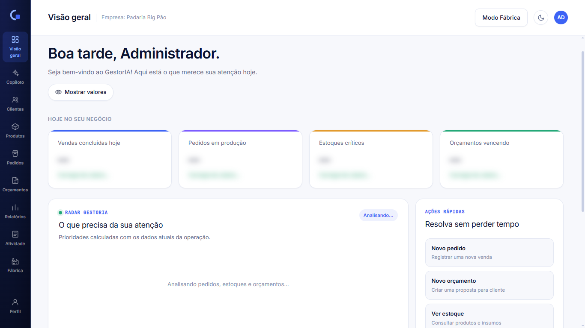
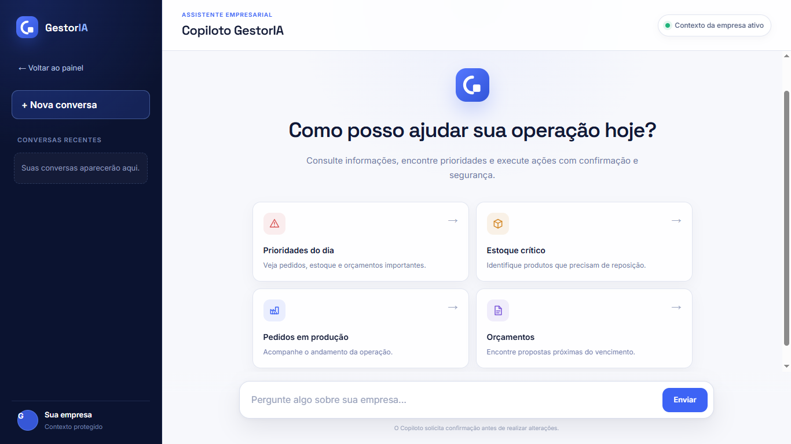
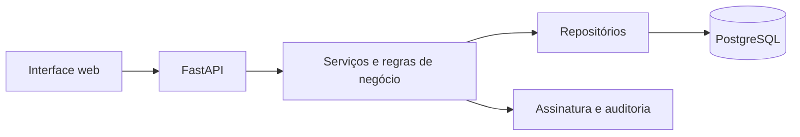

<div align="center">

# GestorIA

### Gestão empresarial com inteligência operacional, segurança transacional e visão unificada do negócio.


</div>

## Sobre o projeto

O **GestorIA** é uma plataforma de gestão empresarial criada para centralizar clientes, produtos, estoque, pedidos, orçamentos e produção em uma experiência simples e orientada por dados.

Mais do que registrar informações, o sistema transforma dados operacionais em prioridades por meio do **Radar GestorIA**, permitindo que a empresa identifique pedidos em produção, estoques críticos e orçamentos próximos do vencimento.

O projeto está em desenvolvimento acadêmico, mas utiliza uma estrutura próxima à de uma aplicação real: backend em camadas, banco PostgreSQL, isolamento entre empresas, operações transacionais e testes automatizados.

> [!NOTE]
> O projeto encontra-se em evolução. Os módulos principais de gestão já utilizam dados reais da API; Copiloto, relatórios avançados e integração fiscal ainda possuem partes em desenvolvimento ou demonstração.

## Visão de futuro

O GestorIA nasce como um projeto acadêmico com a ambição de evoluir para uma **startup de tecnologia voltada à gestão inteligente de empresas**.

Nossa visão é construir uma plataforma capaz de compreender a operação do negócio, transformar dados em prioridades e auxiliar gestores na tomada de decisões. O objetivo é unir gestão, automação e inteligência artificial em uma experiência acessível, segura e orientada à realidade das pequenas e médias empresas.

No futuro, o **Copiloto GestorIA** deverá atuar como uma camada inteligente sobre todos os módulos da plataforma, permitindo consultar informações, antecipar riscos e executar ações mediante confirmação do usuário.


## Visão do produto

### Dashboard e Radar GestorIA

O painel reúne indicadores da operação e destaca automaticamente o que precisa de atenção, como pedidos em produção, estoque crítico e orçamentos próximos do vencimento.



### Copiloto GestorIA

Uma experiência dedicada de assistência empresarial, projetada para consultar informações, encontrar prioridades e futuramente executar ações com confirmação e segurança.




## Diferenciais

- **Radar operacional:** calcula prioridades utilizando os dados atuais da empresa.
- **Modo Fábrica:** acompanha pedidos em produção, atualiza status e consulta insumos.
- **Pedidos protegidos:** utiliza confirmação, idempotência, assinatura HMAC e auditoria.
- **Orçamentos seguros:** preserva preços históricos e impede conversões duplicadas.
- **Controle transacional de estoque:** falhas não deixam pedidos ou movimentações incompletas.
- **Arquitetura multi-tenant:** os dados de cada empresa permanecem isolados.
- **Copiloto GestorIA:** experiência dedicada de assistência empresarial, atualmente em evolução.

## Módulos

| Módulo | Estado | Recursos principais |
| --- | --- | --- |
| Dashboard e Radar | Operacional | Indicadores reais, prioridades e ações rápidas |
| Clientes | Operacional | Cadastro, edição, exclusão e histórico de consumo |
| Produtos e estoque | Operacional | Catálogo, quantidades, estoque mínimo e status |
| Pedidos | Operacional | Fluxo de status, proteção transacional e recomposição de estoque |
| Orçamentos | Operacional | Criação, aprovação, validade e conversão única em pedido |
| Modo Fábrica | Operacional | Produção em tempo real, conclusão de pedidos e consulta de insumos |
| Segurança de pedidos | Operacional | HMAC, confirmação, idempotência, comprovantes e auditoria |
| Copiloto | Em evolução | Interface pronta; inteligência e execução de ações em desenvolvimento |
| Relatórios | Em evolução | Parte dos indicadores ainda utiliza dados simulados |
| Notas fiscais | Protótipo visual | Interface demonstrativa, ainda sem integração fiscal no backend |

## Segurança das operações

A criação de pedidos utiliza uma etapa de preparação e confirmação. A proposta é assinada pelo servidor, possui validade limitada e uma chave de idempotência que impede execuções duplicadas.

Pedido, estoque, comprovante e evento de auditoria são persistidos na mesma transação. Se uma etapa falhar, nenhuma alteração parcial é mantida.

Consulte a [documentação de segurança dos pedidos](docs/SEGURANCA_PEDIDOS.md) para conhecer o contrato das operações, limites e resultados de validação.


## Tecnologias

| Camada | Tecnologias |
| --- | --- |
| Interface | HTML5, JavaScript e Tailwind CSS |
| API | Python 3.12 e FastAPI |
| Persistência | PostgreSQL 17 e SQLAlchemy 2 |
| Migrações | Alembic |
| Autenticação | JWT e Argon2 |
| Segurança operacional | HMAC-SHA256, idempotência e auditoria |
| Infraestrutura | Docker e Docker Compose |
| Qualidade | Pytest e Ruff |

## Executando o projeto

### Pré-requisitos

- Git
- Docker Desktop

### Instalação

Clone o repositório:

```bash
git clone https://github.com/LauraEliza19/gestoria.git
cd gestoria
```

Crie o arquivo de configuração local e gere as chaves das operações protegidas.

No PowerShell:

```powershell
if (!(Test-Path .env)) { Copy-Item .env.example .env }
docker compose run --rm security-init
docker compose up -d --build
```

No Linux ou macOS:

```bash
test -f .env || cp .env.example .env
docker compose run --rm security-init
docker compose up -d --build
```

Após a inicialização, acesse:

| Serviço | Endereço |
| --- | --- |
| Aplicação | `http://localhost:8000` |
| Documentação interativa da API | `http://localhost:8000/docs` |
| Verificação de disponibilidade | `http://localhost:8000/api/health` |

### Usuário de demonstração

```text
E-mail: admin@gestoria.dev
Senha: GestorIA@123
```

As credenciais são destinadas exclusivamente ao ambiente de desenvolvimento e podem ser alteradas no arquivo `.env`.

> [!WARNING]
> Não execute `docker compose down -v` se desejar preservar o banco local. A opção `-v` remove o volume do PostgreSQL.


## Arquitetura

O backend utiliza uma arquitetura em camadas para separar transporte HTTP, regras de negócio e persistência.



```text
gestoria/
├── backend/
│   ├── alembic/          # Migrações do banco
│   ├── app/
│   │   ├── api/          # Rotas HTTP
│   │   ├── models/       # Entidades SQLAlchemy
│   │   ├── repositories/ # Consultas e persistência
│   │   ├── schemas/      # Validação de entrada e saída
│   │   └── services/     # Regras de negócio
│   └── tests/            # Testes automatizados
├── frontend/
│   ├── static/           # CSS e JavaScript
│   └── views/            # Páginas da aplicação
├── docs/                 # Documentação técnica
└── docker-compose.yml
```

A API não executa consultas SQL diretamente nas rotas, e o frontend nunca recebe credenciais do banco.

## Testes e qualidade

### Executar localmente

```powershell
cd backend
py -3.12 -m venv .venv
.\.venv\Scripts\python.exe -m pip install -r requirements-dev.txt -c constraints-tested.txt
.\.venv\Scripts\python.exe -m pytest -q
.\.venv\Scripts\python.exe -m ruff check app tests alembic\versions
```

### Executar com PostgreSQL isolado

```powershell
docker compose -f docker-compose.test.yml up --build --abort-on-container-exit --exit-code-from tests
docker compose -f docker-compose.test.yml down
```

O ambiente de testes em Docker utiliza um banco PostgreSQL temporário, separado dos dados de desenvolvimento.

## Roadmap

- [x] Autenticação e isolamento entre empresas
- [x] Gestão de clientes, produtos e estoque
- [x] Pedidos com controle transacional
- [x] Orçamentos com conversão única
- [x] Radar operacional com dados reais
- [x] Modo Fábrica integrado à API
- [x] Confirmação, idempotência e auditoria de pedidos
- [ ] Tornar o Copiloto GestorIA funcional
- [ ] Substituir indicadores simulados por dados reais
- [ ] Implementar integração fiscal no backend
- [ ] Adicionar testes automatizados do frontend
- [ ] Ampliar a validação de concorrência no PostgreSQL

## Documentação

- [Segurança e confirmação de pedidos](docs/SEGURANCA_PEDIDOS.md)
- [Documentação de contexto](Documentação%20de%20Contexto/)
- [Documentação interativa da API](http://localhost:8000/docs)

## Fluxo de contribuição

1. Atualize sua branch principal.
2. Crie uma branch com um nome que represente a alteração.
3. Implemente e valide a mudança.
4. Registre um commit objetivo.
5. Abra um Pull Request para revisão antes do merge.

Exemplo:

```bash
git switch main
git pull --ff-only origin main
git switch -c feat/nome-da-funcionalidade
```

---

<div align="center">

Desenvolvido como projeto acadêmico com foco em gestão inteligente, segurança e evolução contínua.

</div>