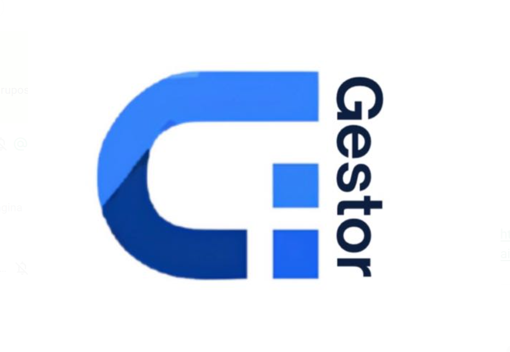

<div align="center">



# GestorIA

### A inteligência que organiza.

Plataforma de gestão empresarial com experiência orientada por inteligência artificial, desenvolvida para centralizar operações, automatizar processos e oferecer mais controle para empresas em crescimento.

<br>

<a href="Documento%20de%20Contexto.md">
  
</a>

<a href="Documentação%20de%20Contexto/Tributos%20e%20Precificacao%20GestorIA.md">
  
</a>

<br><br>


</div>

---

## Sobre o GestorIA

O **GestorIA** é uma plataforma de gestão empresarial com foco em organização, produtividade e adaptabilidade. O sistema foi idealizado para reunir em um único ambiente recursos como:

- Gestão de clientes;
- Gestão de produtos;
- Controle de estoque;
- Pedidos e orçamentos;
- Operações fiscais;
- Indicadores e dashboards;
- Controle de usuários e permissões;
- Recursos de Inteligência Artificial.

O projeto está em desenvolvimento acadêmico com estrutura de aplicação real, backend em camadas, persistência em **PostgreSQL** e isolamento de dados por empresa com arquitetura **multi-tenant**.

> **Mais do que um sistema isolado, o GestorIA foi pensado como um ERP completo.**

---

## Visão do produto

O GestorIA está sendo desenvolvido com base em quatro pilares principais:

| Pilar | Objetivo |
|---|---|
| **Gestão centralizada** | Reunir as principais operações da empresa em uma única plataforma |
| **Inteligência Artificial** | Tornar a interação com o sistema mais natural e eficiente |
| **Segurança** | Proteger dados, operações e histórico das ações realizadas |
| **Adaptabilidade** | Permitir que o sistema acompanhe diferentes modelos de negócio |

---

## Estado atual do MVP

Atualmente, o MVP já conta com os seguintes recursos implementados:

- Autenticação com senha protegida por **Argon2** e sessão **JWT**;
- Usuários vinculados a empresas por papéis (`owner`, `admin` e `member`);
- CRUD manual de produtos com catálogo completo, custo, estoque, validade e dados fiscais;
- CRUD manual de clientes com dados pessoais, contato, endereço, desconto e telefone normalizado;
- Pedidos com múltiplos produtos, preço histórico, baixa transacional e recomposição de estoque em cancelamentos e exclusões;
- Total gasto do cliente calculado a partir dos pedidos concluídos;
- Isolamento **multi-tenant** em todas as consultas de negócio;
- Migrations versionadas com **Alembic**;
- Testes automatizados da API;
- Radar operacional com prioridades e indicadores;
- Página do Copiloto migrada para React.

Orçamentos e dados cadastrais da empresa já utilizam a API. Relatórios e interpretação por IA ainda possuem partes simuladas.

---

## Segurança das operações

A criação direta de pedidos exige proposta assinada e confirmação. O fluxo de segurança inclui:

- **HMAC-SHA256** com chave exclusiva do servidor;
- Proposta com validade;
- Idempotência;
- Confirmação transacional;
- Persistência de comprovante;
- Auditoria de eventos.

Pedido, estoque, comprovante e auditoria são confirmados dentro da mesma transação.

> Consulte [`docs/SEGURANCA_PEDIDOS.md`](docs/SEGURANCA_PEDIDOS.md) para detalhes técnicos, contrato, limites e resultados de validação.

---

## Atualização fiscal — setembro/2026

Notas de saída agora exigem pedido da mesma empresa, com destinatário, itens e valores conferidos no servidor.

Principais pontos da atualização fiscal:

- Notas de saída vinculadas ao pedido;
- Apenas uma saída ativa por pedido;
- Cancelamentos preservam histórico;
- Entradas com fornecedor e recebimento explícito de estoque;
- Eventos fiscais persistidos e consultáveis pela API.

> Leia [`docs/FISCAL_ATUALIZACOES_E_TESTES.md`](docs/FISCAL_ATUALIZACOES_E_TESTES.md) antes de atualizar um banco existente.

Revisão atual do banco:

```text
0006_fiscal_integrity
```

> O registro de eventos externos não constitui emissão ou autorização oficial pela SEFAZ.

---

## Tecnologias

| Camada | Tecnologias |
| --- | --- |
| **Frontend** | React 19, TypeScript, Vite, Tailwind CSS 4 e Lucide React |
| **API** | Python 3.12 e FastAPI |
| **Persistência** | PostgreSQL 17 e SQLAlchemy 2 |
| **Migrations** | Alembic |
| **Autenticação** | JWT e Argon2 |
| **Ambiente** | Docker Compose |
| **Qualidade** | Pytest e Ruff |

---

## Como executar o projeto

### Requisitos

Antes de iniciar, tenha instalado em sua máquina:

- **Docker Desktop** aberto e em execução;
- **Git**;
- Opcionalmente, **Node.js** e **Python**, caso queira rodar partes do projeto fora do Docker.

---

### 1. Clonar o repositório

```bash
git clone <URL_DO_REPOSITORIO>
cd <NOME_DO_REPOSITORIO>
```

---

### 2. Criar o arquivo de ambiente

#### No PowerShell

```powershell
if (!(Test-Path .env)) { Copy-Item .env.example .env }
```

#### No Linux ou macOS

```bash
test -f .env || cp .env.example .env
```

---

### 3. Inicializar a camada de segurança

```bash
docker compose run --rm security-init
```

---

### 4. Subir o projeto

```bash
docker compose up -d --build
```

Esse comando irá:

- construir os containers;
- iniciar a aplicação;
- iniciar o banco PostgreSQL;
- aplicar as migrations automaticamente;
- preparar o usuário de demonstração.

---

### 5. Abrir o projeto

Após a inicialização, acesse:

- **Aplicação:** `http://localhost:8000`
- **Documentação da API:** `http://localhost:8000/docs`

Credenciais de demonstração:

- **E-mail:** `admin@gestoria.dev`
- **Senha:** `GestorIA@123`

> Essas credenciais são exclusivas do ambiente de desenvolvimento e podem ser alteradas no arquivo `.env`.

---

### 6. Como parar o projeto

Para parar os containers:

```bash
docker compose down
```

> **Atenção:** não utilize `docker compose down -v` se quiser preservar os dados locais do PostgreSQL, pois a opção `-v` remove o volume do banco.

---

## Estrutura do banco

| Tabela | Responsabilidade |
| --- | --- |
| `organizations` | Empresas atendidas pela plataforma |
| `users` | Identidade e credenciais dos usuários |
| `organization_members` | Papel do usuário em cada empresa |
| `products` | Catálogo e estoque isolados por empresa |
| `customers` | Clientes isolados por empresa |
| `orders` | Cabeçalho, cliente, status e total do pedido |
| `order_items` | Produtos, quantidades e preços históricos do pedido |
| `order_operations` | Propostas assinadas, idempotência e comprovantes históricos |
| `order_audit_events` | Eventos autenticados de preparação, execução, rejeição e cancelamento |
| `fiscal_documents` | Notas vinculadas, evidências e datas fiscais |
| `fiscal_document_items` | Itens e valores capturados para o histórico |
| `fiscal_events` | Ações fiscais com usuário responsável |
| `suppliers` | Fornecedores de notas de entrada |
| `fiscal_stock_movements` | Recebimentos e estornos de entrada |

O `organization_id` delimita os dados de cada empresa. Pedidos são gravados em uma única transação: se qualquer produto não existir ou não tiver estoque suficiente, nenhuma alteração é persistida.

---

## Organização

O backend segue arquitetura em camadas. O frontend utiliza React com TypeScript, React Router e Tailwind CSS.

```text
frontend/
  src/
    app/                  roteamento e composição da aplicação
    layouts/              layouts autenticado e de navegação
    pages/                telas React por domínio
    services/             cliente HTTP e autenticação
    styles/               entrada Tailwind e tokens visuais
  dist/                   build de produção gerado pelo Vite

backend/
  alembic/                migrations versionadas do banco
  app/
    api/                  controllers HTTP (rotas)
    models/               tabelas e relacionamentos SQLAlchemy
    schemas/              validação de entrada e saída
    repositories/         consultas e persistência
    services/             autenticação e regras transacionais
    security.py           senha e token
    seed.py               dados iniciais de desenvolvimento
  tests/                  testes de API, transações e isolamento
```

---

## Testes e qualidade

```powershell
cd backend
python -m venv .venv
.venv\Scripts\Activate.ps1
pip install -r requirements-dev.txt
pytest -q
ruff check app tests alembic\versions
```

Os testes locais usam SQLite temporário com chaves estrangeiras ativadas.

Para validar também migrations e concorrência no PostgreSQL 17:

```bash
docker compose -p gestoria-fiscal-tests -f docker-compose.test.yml up --build --abort-on-container-exit --exit-code-from tests
```

---

## Evoluir o schema

Depois de alterar os modelos, gere uma nova migration em vez de editar uma migration já aplicada:

```powershell
docker compose exec api alembic revision --autogenerate -m "descricao da alteracao"
docker compose exec api alembic upgrade head
```

---

## Rotas implementadas

| Método | Rota | Uso |
| --- | --- | --- |
| `POST` | `/api/auth/login` | Autenticar usuário |
| `GET` | `/api/auth/me` | Consultar a sessão atual |
| `GET` | `/api/products` | Listar produtos da empresa |
| `POST` | `/api/products` | Cadastrar produto |
| `PATCH` | `/api/products/{id}` | Editar produto |
| `DELETE` | `/api/products/{id}` | Excluir produto sem vínculos |
| `GET` | `/api/customers` | Listar clientes com total gasto |
| `POST` | `/api/customers` | Cadastrar cliente |
| `PATCH` | `/api/customers/{id}` | Editar cliente |
| `DELETE` | `/api/customers/{id}` | Excluir cliente sem pedidos |
| `GET` | `/api/orders` | Listar pedidos com seus itens |
| `POST` | `/api/orders` | Criação antiga bloqueada com HTTP 428 |
| `POST` | `/api/orders/proposals` | Preparar proposta assinada, sem alterar estoque |
| `POST` | `/api/orders/proposals/{id}/confirm` | Confirmar proposta e registrar pedido uma única vez |
| `POST` | `/api/orders/proposals/{id}/cancel` | Descartar proposta pendente |
| `GET` | `/api/orders/proposals/{id}/receipt` | Consultar comprovante verificado |
| `GET` | `/api/orders/security/events` | Consultar eventos autorizados e sua integridade |
| `PATCH` | `/api/orders/{id}` | Atualizar o status do pedido |
| `DELETE` | `/api/orders/{id}` | Excluir pedido sem histórico fiscal e recompor estoque como owner/admin |
| `GET` | `/api/fiscal-documents` | Listar e filtrar documentos fiscais |
| `POST` | `/api/fiscal-documents` | Registrar saída por pedido ou entrada por fornecedor/itens |
| `PATCH` | `/api/fiscal-documents/{id}` | Registrar transição permitida com evidência externa |
| `DELETE` | `/api/fiscal-documents/{id}` | Exclusão bloqueada (409), histórico preservado |
| `GET` | `/api/fiscal-documents/{id}` | Consultar detalhes e eventos |
| `POST` | `/api/fiscal-documents/{id}/link-order` | Conciliar saída histórica |
| `POST` | `/api/fiscal-documents/{id}/receive` | Confirmar recebimento de entrada uma única vez |
| `GET/POST` | `/api/fiscal-suppliers` | Listar/cadastrar fornecedores |
| `PATCH` | `/api/fiscal-suppliers/{id}` | Ativar/desativar fornecedor |
| `GET` | `/api/health` | Verificar a disponibilidade da API |

---

## Conferir os clientes no PostgreSQL

```powershell
docker compose exec db psql -U gestoria -d gestoria
```

No `psql`:

```sql
SELECT c.id, c.name, c.phone, c.created_at, o.name AS organization
FROM customers AS c
JOIN organizations AS o ON o.id = c.organization_id
ORDER BY c.created_at DESC;
```

Os registros exibidos na tela de Clientes vêm de `GET /api/customers`; não existe uma lista fixa no frontend. Saia do terminal com `\q`.

---

## Observações finais

Antes de qualquer implantação pública, altere:

- `JWT_SECRET`;
- senha do PostgreSQL;
- credenciais de demonstração.
